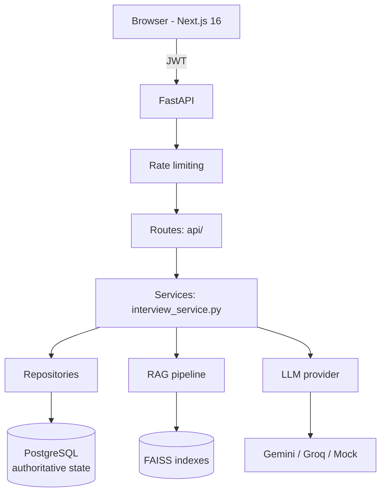
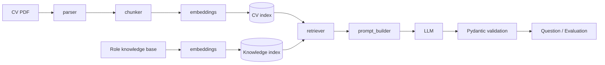

# AI Interview Agent

An adaptive technical-interview platform: it reads a candidate's CV, checks it
against the chosen role, and runs a five-question interview where each question
is built from that CV plus a role knowledge base, each answer is scored by an
LLM, and the next question's difficulty follows the score.

[](https://github.com/AbdoAhmed666/AI-Interview-Agent/actions/workflows/ci.yml)

---

## What it does

A candidate signs up, uploads a CV, and picks one of four roles. The CV is
parsed and analysed, and the role is accepted only if the profile actually
supports it — otherwise the candidate is told why, with better-matching roles
suggested. From there the interview runs five questions, adapting as it goes,
and ends with an overall score, a hiring recommendation, and a downloadable PDF
report.

```
CV upload → role eligibility → RAG retrieval → adaptive interview (×5)
          → LLM evaluation → overall score + recommendation → PDF report
```

Roles supported today: **Backend Engineer**, **Frontend Engineer**,
**ML Engineer**, **Data Scientist** — each with its own knowledge base under
[`backend/knowledge_base/`](backend/knowledge_base).

**Demo video:** [walkthrough on LinkedIn](https://www.linkedin.com/posts/abdelrhman-ahmed-92a432260_aiengineer-llm-generativeai-activity-7495509567758372864-Bfjz?utm_source=share&utm_medium=member_desktop&rcm=ACoAAEAitbIBM-s1FybPxKNLLcR68QSOyuy-Tio)

---

## Quick start

The whole stack — PostgreSQL, the API and the UI — comes up with one command.
The embedding model is baked into the backend image, so the container starts
without downloading anything, and migrations are applied before the API serves
a request.

```bash
git clone https://github.com/AbdoAhmed666/AI-Interview-Agent.git
cd AI-Interview-Agent

cp .env.docker.example .env
```

`SECRET_KEY` has no default and compose refuses to start without one:

```bash
python -c "import secrets; print(secrets.token_urlsafe(48))"
```

Put that value in `.env`, then:

```bash
docker compose up --build
```

| Service  | URL                        |
| -------- | -------------------------- |
| Frontend | http://localhost:3000      |
| API      | http://localhost:8000      |
| API docs | http://localhost:8000/docs |

`LLM_PROVIDER=mock` is the default, so the stack runs end to end with no API
key. Set `LLM_PROVIDER=gemini` (or `groq`, or `router`) plus the matching key in
`.env` for real model output — an environment change only, no rebuild.

The first build is slow: it installs PyTorch and pre-fetches the embedding
model.

---

## Architecture



The layering is deliberate and enforced by convention:

| Layer            | Responsibility                                              |
| ---------------- | ----------------------------------------------------------- |
| `backend/api/`   | HTTP: request shape, auth dependency, status codes           |
| `backend/services/` | The workflow. Owns transactions, calls the AI components  |
| `backend/repositories/` | Database primitives. Flush, never commit — the caller owns the transaction |

---

## Interview state machine

Interview progress is held in PostgreSQL, not in server memory. A restart, a
second API worker, or a browser reload does not erase an interview in progress.

Session states — [`backend/schemas.py`](backend/schemas.py):

```
IN_PROGRESS → GENERATING → READY_TO_FINISH → COMPLETED
     │             │
     │             └→ GENERATION_FAILED
     └→ ABANDONED   (the candidate deliberately started a different interview)
```

Question states:

```
ACTIVE → EVALUATING → EVALUATED
              └→ EVALUATION_FAILED
```

What the implementation in
[`backend/services/interview_service.py`](backend/services/interview_service.py)
and
[`backend/repositories/interview_repository.py`](backend/repositories/interview_repository.py)
actually does:

- **Row locks.** Every transition takes `SELECT ... FOR UPDATE` on the session
  and question rows, so two concurrent requests cannot both advance the same
  interview.
- **Idempotent submission.** Submitting the same answer twice returns the first
  result rather than re-evaluating; a *different* answer for an
  already-answered question is rejected.
- **An audit row per transition.** `interview_audit_log` records the event, the
  statuses moved between, and when — so the history of an interview is
  reconstructable after the fact.
- **Recovery from interrupted work.** An evaluation whose worker died is picked
  up again once its lease goes stale; a fresh lease is treated as another worker
  still holding it, and left alone.
- **Guarded question generation.** The question number is recomputed inside the
  final locked transaction, and a concurrent insert is caught and resolved to
  the question the other worker created rather than failing.
- **Resume after reload.** `GET /active-interview` rebuilds the client's view
  from the database — the open question, its number, the difficulty, and the
  previous answer's evaluation — and carries forward a session that stopped
  part-way through.

Schema changes go through Alembic; there are six migrations in
[`backend/alembic/versions/`](backend/alembic/versions).

---

## The AI pipeline



Implementation in [`backend/rag/`](backend/rag) and
[`backend/cv/`](backend/cv).

**Retrieval draws on two sources.** The query is embedded once, then run
against the candidate's own CV index *and* the role's knowledge index; the
results are merged and sorted by similarity, so a generated question is grounded
in both the candidate's experience and the role's material. This is two-source
dense retrieval — not a dense/sparse hybrid in the BM25 sense.

**Vector stores are isolated per request.**
[`rag_service.py`](backend/rag/rag_service.py) hands each request its own CV and
knowledge stores rather than keeping one on the service object, and serialises
index build-and-load per directory with a lock. The shared-store version had a
real failure mode: two candidates interviewing at once could have one CV
overwrite the other's retrieval context.

**Model output is validated, not trusted.** The LLM's evaluation is parsed into
`EvaluationResponse` — a bounded score, a level, strengths, weaknesses,
feedback, concept gaps, a follow-up question, and `extra: forbid`. Output that
does not fit moves the question to `EVALUATION_FAILED`, which is retryable,
rather than being stored half-formed.

**Difficulty adapts** in [`adaptive_engine.py`](backend/adaptive_engine.py): a
`strong` answer raises it by one (capped at 5), a `weak` one lowers it (floored
at 1), anything else holds.

**Providers** are behind one interface in
[`llm_provider.py`](backend/llm_provider.py): `GeminiProvider`, `GroqProvider`,
a `RouterProvider`, and `MockLLMProvider` — the last is for development and
tests, and is what lets the whole suite run with no API key and no network.

---

## Rate limiting

[`backend/rate_limit.py`](backend/rate_limit.py) puts two independent limits in
front of the endpoints that cost money, because they do different jobs:

- **Per caller** — stops one visitor crowding everyone else out.
- **Globally, across all callers** — this is the limit that bounds LLM spend. A
  per-caller limit alone is defeated by anyone who can vary the address they
  appear to come from; a global count never asks who is calling.

The credential endpoints are rate-limited too, where repeated attempts are the
attack rather than the cost. `/health` never is — a throttled probe reads as an
outage. Limits and whether `X-Forwarded-For` is trusted are environment
settings; see [`.env.docker.example`](.env.docker.example).

State is in process memory, which fits a single API container. It is a cost
guard, not a security control.

---

## Features

- **CV upload and analysis** — PDF extraction, skill analysis, per-user storage.
  A new CV is stored inactive and only becomes the active one after indexing and
  analysis succeed, so a failed upload leaves the previous CV in place.
- **Role eligibility** — the interview will not start on a role the CV does not
  support; the candidate gets a score, a reason, and recommended roles instead.
- **Adaptive interview** — five questions, difficulty following performance.
- **Structured evaluation** — score, level, strengths, weaknesses, feedback,
  concept gaps and a follow-up question for every answer.
- **Interview history** — per-candidate, with the full question and answer trail.
- **Dashboard** — completion rate, average and best score, score trend, and
  average by role.
- **PDF report** — a recruiter-style summary, generated with ReportLab.
- **Authentication** — JWT with bcrypt-hashed passwords; history and CVs are
  scoped to the authenticated user.

---

## Testing and CI

```bash
cd backend && python -m pytest -q     # needs PostgreSQL and DATABASE_URL
cd frontend && npm test
```

Last run on a database migrated from scratch:

```
backend    112 passed, 9 skipped
frontend    26 passed
```

The nine skips are legacy manual scripts that need either local CV fixtures or
a network download of the embedding model; they skip deliberately rather than
fail.

The suite is hermetic. [`backend/conftest.py`](backend/conftest.py) seeds
exactly the state the durable-workflow tests expect and tears it down again, so
the suite passes on any clean database rather than on one developer's machine.

[`.github/workflows/ci.yml`](.github/workflows/ci.yml) runs three jobs on every
push, and the third is the one worth knowing about:

| Job | What it does |
| --- | --- |
| Backend tests | PostgreSQL service container, migrations, `pytest` |
| Frontend tests and build | `vitest`, then `next build` |
| Docker images | Builds **both** images, runs `docker compose up --wait`, and checks that the API and the UI actually respond |

That last job is why the badge means something: it proves the containers build
*and* start *and* serve, not merely that the Dockerfiles parse. It is gated to
pull requests and `main`, since a cold backend build takes around fifteen
minutes.

---

## Running without Docker

Requires Python 3.11 and a running PostgreSQL 16.

```bash
python -m venv .venv
source .venv/bin/activate        # Windows: .venv\Scripts\activate
pip install -r requirements.txt

cp .env.example .env             # set DATABASE_URL and SECRET_KEY

cd backend
alembic upgrade head
uvicorn main:app --reload
```

In a second terminal:

```bash
cd frontend
npm install
npm run dev
```

A note on the database driver: this project ships `psycopg` v3, not `psycopg2`.
SQLAlchemy resolves a driver-less `postgresql://` URL to psycopg2 and fails with
`ModuleNotFoundError: No module named 'psycopg2'`, so
[`backend/database.py`](backend/database.py) rewrites `postgres://` and
`postgresql://` to `postgresql+psycopg://`. Hosting providers hand out both
forms, so either works as `DATABASE_URL`.

---

## Deployment

[`DEPLOY.md`](DEPLOY.md) documents a path with no hosting cost: Vercel for the
frontend, Hugging Face Spaces for the API (its free tier has the memory the
embedding model needs), and Neon for PostgreSQL. It is written with the
limitations of that setup stated rather than glossed over.

There is no public instance running at the moment.

---

## Project structure

```
.
├── Dockerfile                  backend image (build context is the repo root)
├── docker-compose.yml
├── DEPLOY.md
├── requirements.txt
├── backend/
│   ├── main.py                 app, middleware, CORS, /health
│   ├── config.py               settings; refuses to boot on unsafe config
│   ├── database.py             engine, session factory, URL normalisation
│   ├── models.py  schemas.py   ORM models; Pydantic contracts and enums
│   ├── security.py  auth.py    JWT, bcrypt, the current-user dependency
│   ├── rate_limit.py
│   ├── api/                    cv.py · history.py · interview.py
│   ├── services/               interview_service.py · cv_service.py
│   ├── repositories/           interview_repository.py
│   ├── rag/                    parser · chunker · embeddings · vector_store
│   │                           retriever · prompt_builder · query_builder
│   ├── cv/                     analyzer · eligibility · role matching · storage
│   ├── evaluator.py            LLM evaluation, summary, PDF report
│   ├── llm_provider.py         Gemini · Groq · Router · Mock
│   ├── adaptive_engine.py
│   ├── knowledge_base/         per-role technical material
│   ├── alembic/versions/       six migrations
│   └── test_*.py               the backend suite
├── frontend/
│   ├── app/                    login · register · dashboard · interview
│   │                           history · profile
│   ├── components/interview/
│   ├── hooks/useInterview.ts   interview state and the submit/resume flow
│   ├── lib/                    axios · sessionStatus · analytics
│   └── services/               API clients
└── docs/LEARNING.md
```

---

## Known limitations

Stated plainly, because they decide where this can and cannot be run:

- **Uploaded CVs and FAISS indexes are on local disk.** The runtime storage
  design therefore assumes a single API instance. Running several replicas needs
  those moved to object storage first.
- **Migrations run from the container entrypoint.** Fine for one container;
  several replicas racing to migrate on deploy want a separate one-shot job.
- **The JWT is kept in `localStorage`**, not an httpOnly cookie, which leaves it
  reachable from JavaScript.
- **No structured observability** — no metrics, no tracing, no error tracking.
- **Rate limiting is in-process**, so each replica would enforce its own share.
- **Voice and video interviews are not implemented.** They are ideas, not code.
- **The screenshots in `iamges/` are from an older UI** and no longer match the
  application; they are kept only for history.

---

## Studying this codebase

[`docs/LEARNING.md`](docs/LEARNING.md) maps the project for anyone who wants to
understand it rather than just run it: the path a single request takes, the
durable state machine and its locks, the RAG pipeline, the test suite, the
container setup, and the decisions behind each — with the questions worth being
able to answer about every one.

---

## Author

**Abdelrhman Ahmed**
AI Engineer | Machine Learning | LLMs | RAG | FastAPI | Python
[github.com/AbdoAhmed666](https://github.com/AbdoAhmed666)

## License

MIT.

## Built with

Python · FastAPI · SQLAlchemy · Alembic · PostgreSQL · Next.js · React ·
TypeScript · Tailwind · FAISS · sentence-transformers · LangChain · Gemini ·
Groq · ReportLab · JWT · Docker · pytest · vitest
